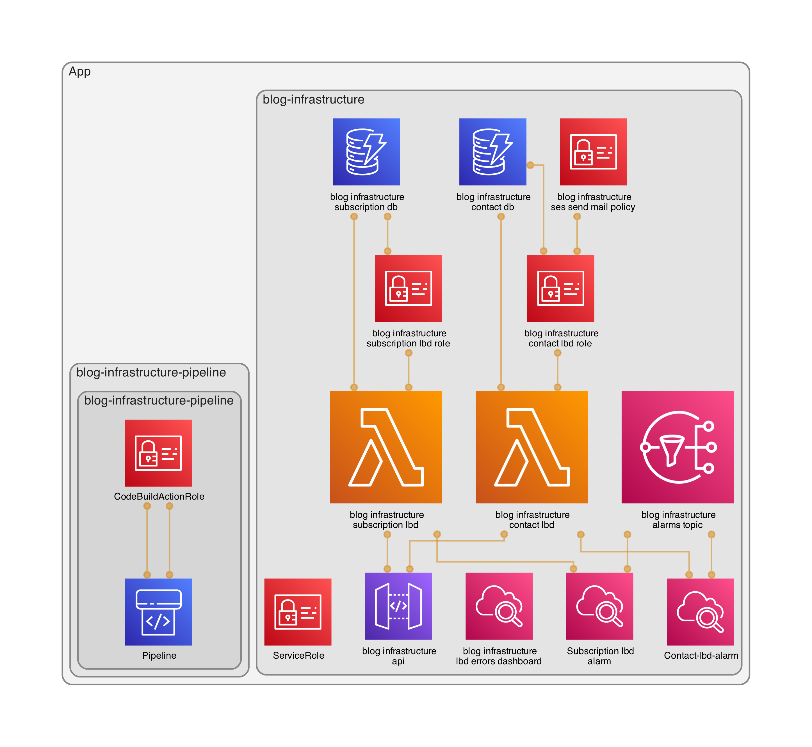

# Blog-infrastructure

This is the public infrastructure code of my [blog](https://www.playingaws.com/).

Architecture diagram:


CDK project with 2 stacks:

- Backend:
  - API Gateway using custom domain
  - Lambdas
  - DynamoDB
  - CloudWatch: lambda alarm and dashboard of lambdas
- CICD:
  - CodePipeline with 2 stages
    - source: CodeCommit with GitHub
    - build: CodeBuild (executes terraform apply)
  - S3 (as artifactory in CodePipeline)

## Review QA

```npm run lint && npm run test```

## Test with SAM

1. Download and run docker image of dynamodb-local

``` console
docker pull amazon/dynamodb-local
docker run -p 8000:8000 amazon/dynamodb-local
```

2. Create dynamodb-local tables - review the template.yaml because the ID is going to change

``` console
aws dynamodb create-table --table-name bloginfrastructuresubscriptiondbF44CF6DE --attribute-definitions AttributeName=email,AttributeType=S --key-schema AttributeName=email,KeyType=HASH --provisioned-throughput ReadCapacityUnits=1,WriteCapacityUnits=1 --endpoint-url http://localhost:8000
aws dynamodb create-table --table-name bloginfrastructurecontactdbA1E13C61 --attribute-definitions AttributeName=name,AttributeType=S --key-schema AttributeName=name,KeyType=HASH --provisioned-throughput ReadCapacityUnits=1,WriteCapacityUnits=1 --endpoint-url http://localhost:8000
```

3. Update lambda code to change the endpoint:

``` console
const dbClient = process.env.AWS_SAM_LOCAL ? new DynamoDBClient({ endpoint: 'http://docker.for.mac.localhost:8000/', }) : new DynamoDBClient();
```

4. Generate the YAML file that SAM needs

``` console
cdk synth blog-infrastructure --no-staging > template.yml
```

5. Run SAM tests

``` console
sam local invoke blog-infrastructure-contact-lbd -e tests/events/contact.json
sam local invoke blog-infrastructure-subscription-lbd -e tests/events/subscription.json
```

6. Review database records

``` console
aws dynamodb scan --table-name bloginfrastructuresubscriptiondbF44CF6DE --endpoint-url http://localhost:8000
aws dynamodb scan --table-name bloginfrastructurecontactdbA1E13C61 --endpoint-url http://localhost:8000
```

## More information

- How to create infrastructure with CDK [here](https://www.playingaws.com/posts/how-to-create-infrastructure-with-cdk/).
- How to add CI/CD to my CDK project [here](https://www.playingaws.com/posts/how-to-add-ci-cd-to-my-cdk-project/).
- How to create serverless applications with CDK and SAM [here](https://www.playingaws.com/posts/how-to-create-serverless-applications-with-cdk-and-sam/)
- How I decided on the technology behind the blog [here](https://www.playingaws.com/posts/the-technology-behind-this-blog/).
- API CDK v2 TypeScript: [here](https://docs.aws.amazon.com/cdk/api/v2/docs/aws-construct-library.html)
