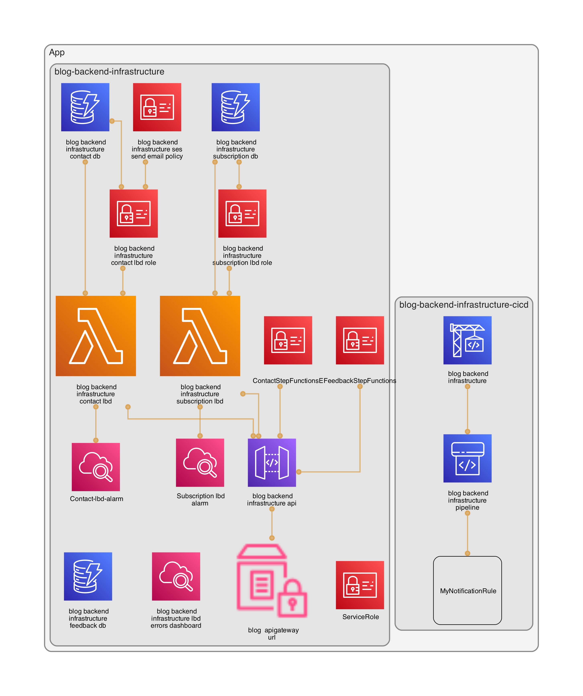

# Blog-backend-infrastructure

- [Blog-backend-infrastructure](#blog-backend-infrastructure)
  - [Description](#description)
  - [Technology used](#technology-used)
  - [Type](#type)
  - [More information](#more-information)
    - [Review QA](#review-qa)
    - [Test with SAM](#test-with-sam)
    - [Additional links](#additional-links)

## Description

This is the public infrastructure code of my blog (https://www.playingaws.com). This project is an `example of a CDK project with 2 stacks`: the infrastructure (backend) and the CICD to automate the infrastructure deployment.

## Technology used

CDK project using TypeScript. It contains 2 stacks:

- `Backend`: This stack contains the infrastructure to be deployed
  - `API Gateway` using a custom domain (api.playingaws.com)
  - `Lambda`: subscription and contact
  - `DynamoDB`
  - `CloudWatch`: lambda alarm and dashboard of lambdas
- `CICD`: This stack contains the automation of the backend infrastructure
  - `CodePipeline` with 2 stages
    - source: `CodeCommit` with GitHub
    - build: `CodeBuild` (executes terraform apply)
  - `S3` (as artifactory in CodePipeline)

Architecture diagram - autogenerated with [cdk-dia](https://github.com/pistazie/cdk-dia)

- ```npm run dia```
- 

## Type

Public code

## More information

### Review QA

```shell
npm run lint && npm run test
```

### Test with SAM

1. Download and run docker image of dynamodb-local

```shell
docker pull amazon/dynamodb-local
docker run -p 8000:8000 amazon/dynamodb-local
```

2. Create dynamodb-local tables - review the template.yaml because the ID is going to change

```shell
aws dynamodb create-table --table-name bloginfrastructuresubscriptiondbF44CF6DE --attribute-definitions AttributeName=email,AttributeType=S --key-schema AttributeName=email,KeyType=HASH --provisioned-throughput ReadCapacityUnits=1,WriteCapacityUnits=1 --endpoint-url http://localhost:8000
aws dynamodb create-table --table-name bloginfrastructurecontactdbA1E13C61 --attribute-definitions AttributeName=name,AttributeType=S --key-schema AttributeName=name,KeyType=HASH --provisioned-throughput ReadCapacityUnits=1,WriteCapacityUnits=1 --endpoint-url http://localhost:8000
```

3. Update lambda code to change the endpoint:

```shell
const dbClient = process.env.AWS_SAM_LOCAL ? new DynamoDBClient({ endpoint: 'http://docker.for.mac.localhost:8000/', }) : new DynamoDBClient();
```

4. Generate the YAML file that SAM needs

```shell
cdk synth blog-backend-infrastructure --no-staging > template.yml
```

5. Run SAM tests

```shell
sam local invoke blog-backend-infrastructure-contact-lbd -e tests/events/contact.json
sam local invoke blog-backend-infrastructure-subscription-lbd -e tests/events/subscription.json
```

6. Review database records

```shell
aws dynamodb scan --table-name bloginfrastructuresubscriptiondbF44CF6DE --endpoint-url http://localhost:8000
aws dynamodb scan --table-name bloginfrastructurecontactdbA1E13C61 --endpoint-url http://localhost:8000
```

### Additional links 
- How to create infrastructure with CDK [here](https://www.playingaws.com/posts/how-to-create-infrastructure-with-cdk/).
- How to add CI/CD to my CDK project [here](https://www.playingaws.com/posts/how-to-add-ci-cd-to-my-cdk-project/).
- How to create serverless applications with CDK and SAM [here](https://www.playingaws.com/posts/how-to-create-serverless-applications-with-cdk-and-sam/)
- How I decided on the technology behind the blog [here](https://www.playingaws.com/posts/the-technology-behind-this-blog/).
- API CDK v2 TypeScript: [here](https://docs.aws.amazon.com/cdk/api/v2/docs/aws-construct-library.html)
